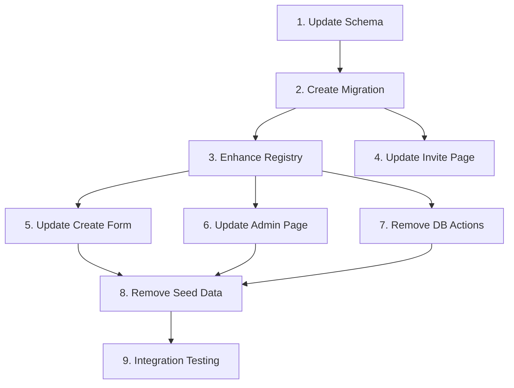

# Implementation Tasks

## Phase 1: Schema & Data Layer

1. **Update Prisma schema**
   - Remove `Style` model
   - Change `Invitation.styleId` to `Invitation.styleKey` (String)
   - Remove foreign key constraint
   - Validation: `npx prisma validate`

2. **Create database migration**
   - Generate migration with `npx prisma migrate dev`
   - Validation: Migration executes without errors

## Phase 2: Core Implementation

3. **Enhance template registry**
   - Add `STYLES` constant with complete style metadata:
     - `key`: String identifier (e.g., `"TechFuture"`)
     - `name`: Display name (e.g., `"Tech Future"`)
     - `previewUrl`: Preview image path
     - `isActive`: Boolean (always true for now)
   - Export `getStyleByKey()` and `getAllStyles()` functions
   - Validation: TypeScript compiles without errors

4. **Update invitation page**
   - Change from `invitation.style.component` to `invitation.styleKey`
   - Use `getTemplate(invitation.styleKey)`
   - Validation: Invitation pages render correctly

## Phase 3: Dashboard & Admin

5. **Update create invitation form**
   - Replace DB query with `getAllStyles()`
   - Store `styleKey` instead of `styleId`
   - Validation: Can create new invitations

6. **Update admin templates page**
   - Remove DB query for styles
   - Use hardcoded `STYLES` for display
   - Note: Toggle active/inactive may need different approach
   - Validation: Admin page displays styles

7. **Remove style DB actions**
   - Delete `getStyles()`, `toggleStyleActiveAction()` from actions.ts
   - Validation: No unused imports/exports

## Phase 4: Cleanup

8. **Remove style seed data**
   - Remove style inserts from `prisma/seed.ts`, `seed-neon.sql`, `init-neon.sql`
   - Validation: Build succeeds

9. **Integration testing**
   - Create invitation with each style
   - View invitation renders correctly
   - Validation: E2E tests pass

## Dependencies

- Task 1 must complete before Task 2
- Tasks 3-4 can run in parallel after Task 2
- Tasks 5-7 can run in parallel after Task 3
- Task 8 can run after Tasks 5-7
- Task 9 runs last

## Parallelizable Work

